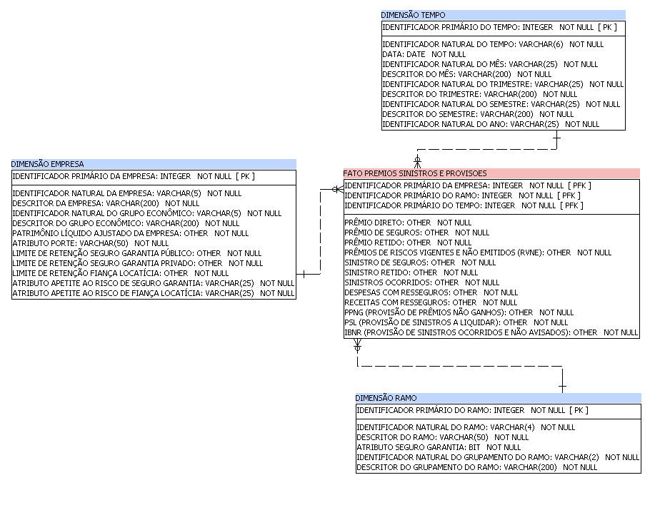
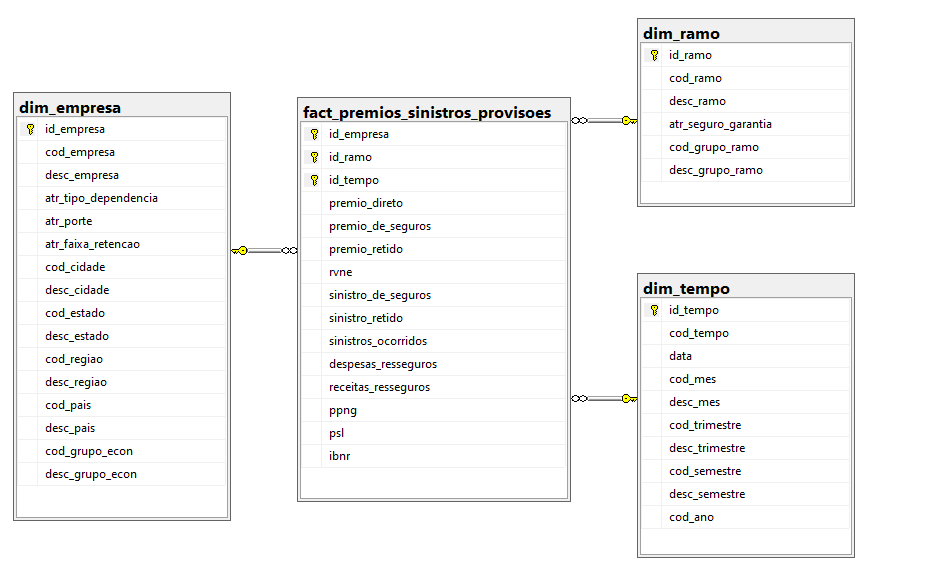
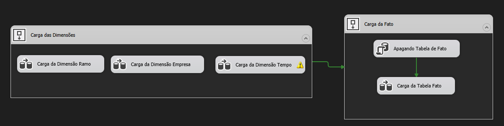
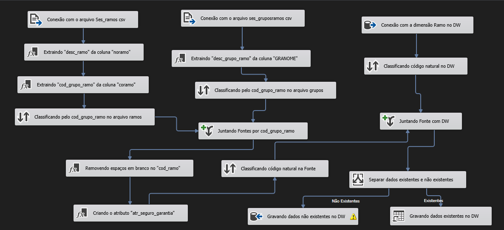
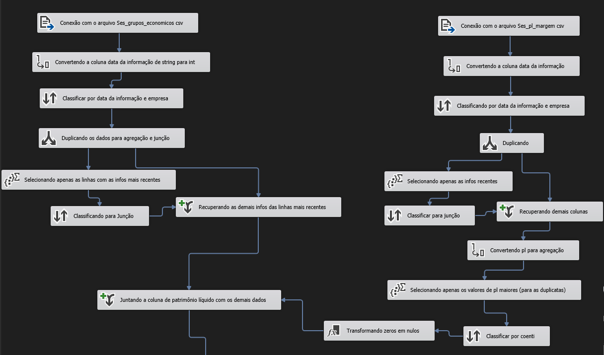
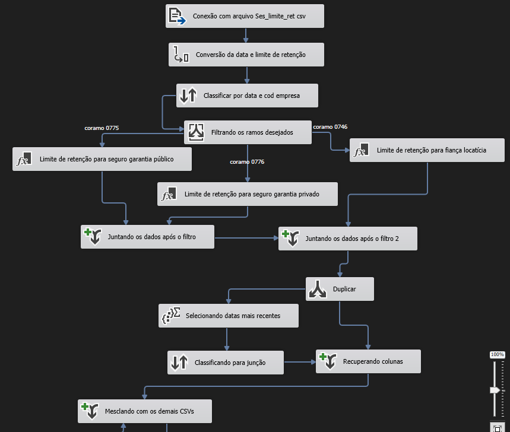
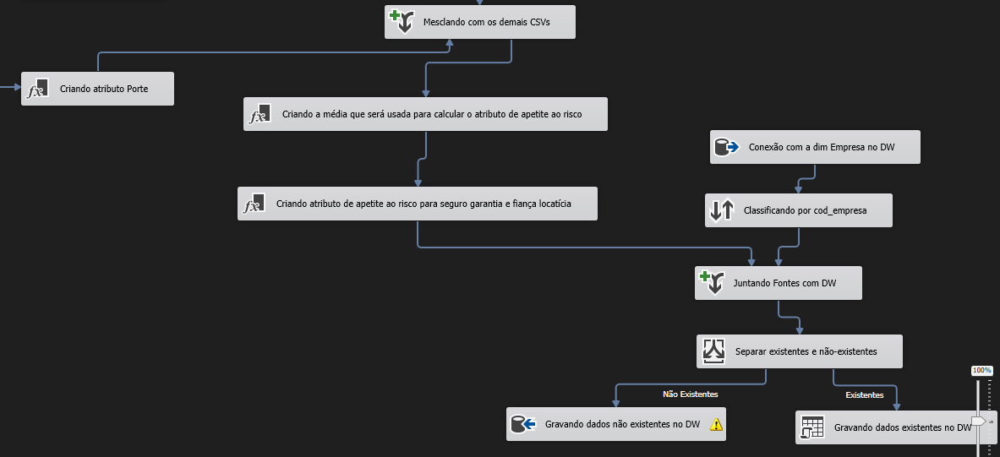
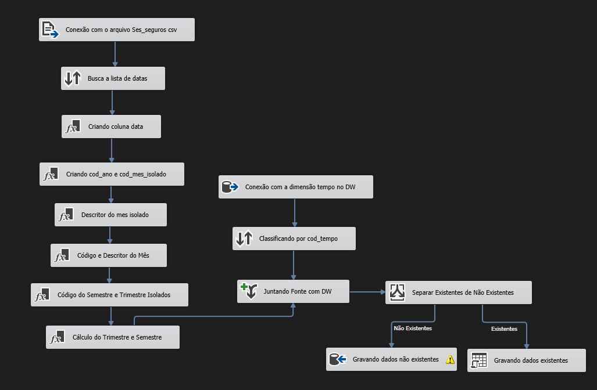
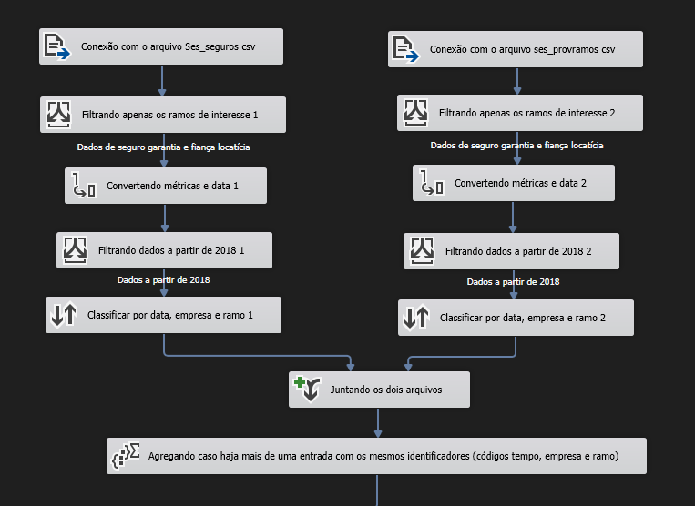
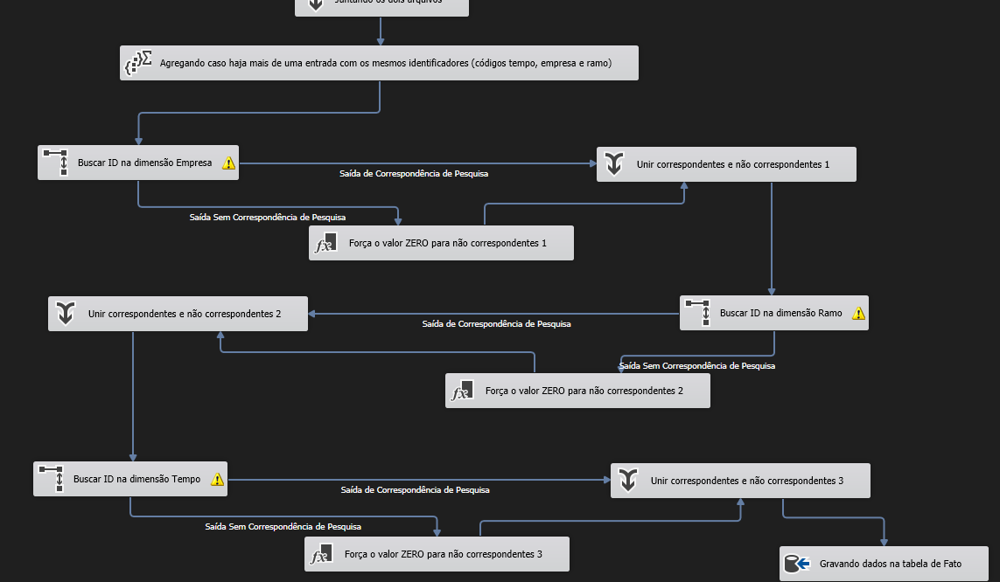

# Projeto de ETL e Modelagem de Dados no Setor de Seguros

## Contexto do Negócio 💼

O setor de seguros desempenha um papel crucial na economia, oferecendo proteção financeira contra diversos riscos. No Brasil, a Superintendência de Seguros Privados (SUSEP) é o órgão responsável por regular e supervisionar o mercado de seguros, garantindo sua estabilidade e transparência. Apesar da vasta quantidade de dados públicos disponibilizados pela SUSEP, a falta de estruturação e o formato muitas vezes não padronizado desses dados representam desafios significativos. Essa realidade sublinha a importância de desenvolver processos eficientes de ETL e a criação de Data Warehouses que possam transformar esses dados brutos em informações estruturadas, acessíveis e analisáveis, especialmente em nichos específicos como o seguro garantia e a fiança locatícia.

## Objetivo 🎯
Este projeto visa a elaboração de um processo completo de ETL a partir de fontes de dados públicas, especificamente dados da SUSEP, e a criação de um Data Warehouse otimizado para os ramos de seguro garantia e fiança locatícia. O objetivo é não apenas organizar e estruturar os dados de maneira eficaz, mas também facilitar análises profundas que possam apoiar decisões estratégicas e promover inovações no setor de seguros.

## Tópicos📌
- [Visão Geral🌐](#visão-geral)
- [Ferramentas e Tecnologias Utilizadas🛠️](#ferramentas-e-tecnologias-utilizadas%EF%B8%8F)
- [Dados📊](#dados)
- [Modelagem do Data Warehouse📦](#modelagem-do-data-warehouse)
- [Elaboração dos Fluxos de Carga🔀](#elaboração-dos-fluxos-de-carga)
    - [Carga da Dimensão Ramo✏️](#carga-da-dimensão-ramo%EF%B8%8F)
    - [Carga da Dimensão Empresa🏢](#carga-da-dimensão-empresa)
    - [Carga da Dimensão Tempo⏳](#carga-da-dimensão-tempo)
    - [Carga da Tabela de Fato📈](#carga-da-tabela-de-fato)
- [Exportação da Base de Dados📤](#exportação-da-base-de-dados)
- [Atualização dos Dados🔄](#atualização-dos-dados)
- [Conclusões e Recomendações💡](#conclusões-e-recomendações)
- [Considerações Finais📝](#considerações-finais)
- [Créditos👏](#créditos)
- [Licença©️](#licença%EF%B8%8F)
- [Disclaimer⚠️](#disclaimer%EF%B8%8F)

## Visão Geral🌐

### Etapa 1 - Coleta de dados:
Nesta etapa inicial, realizar a coleta de dados diretamente do site da SUSEP e analisar os dados e a documentação disponível. Esse processo visa entender as necessidades de informação e preparar a base para a modelagem eficaz do Data Warehouse.

### Etapa 2 - Modelagem do Data Warehouse:
Após a coleta e análise dos dados, a fase seguinte envolve modelar o Data Warehouse. Usar o SQL Power Architect para desenvolver o modelo que organiza e estrutura os dados de maneira lógica e eficiente. Com o modelo pronto, executar o script no SQL Server 2022 para estabelecer a estrutura do Data Warehouse.

### Etapa 3 - Elaboração dos Fluxos de Carga:
Com a estrutura do Data Warehouse estabelecida, elaborar e implementar os fluxos de carga de dados. Esses fluxos, essenciais para a integração dos dados no sistema, serão desenvolvidos no Visual Studio 2022, utilizando o SSIS para realizar as operações de extração, transformação e carga (ETL). Esta etapa garante que os dados coletados sejam processados corretamente e carregados no Data Warehouse.

### Etapa 4 - Exportação do Data Warehouse:
Por fim, exportar a base de dados do Data Warehouse em formato de arquivos CSV. Este procedimento facilita o acesso e a distribuição dos dados, permitindo seu uso para análises futuras e compartilhamento conforme necessário. A exportação dos dados conclui o projeto, deixando os dados organizados e acessíveis.

## Ferramentas e Tecnologias Utilizadas🛠️

- **SQL Server Integration Services (SSIS)**: Ferramenta utilizada para desenvolver soluções de integração de dados, como extração, transformação e carga (ETL), essencial para alimentar o Data Warehouse.

- **SQL Power Architect**: Aplicativo utilizado para modelar o Data Warehouse, permitindo uma visualização gráfica das tabelas, relacionamentos e fluxos de dados, facilitando o projeto e a organização da estrutura de dados.

- **SQL Server 2022**: Sistema de gerenciamento de banco de dados utilizado para hospedar o Data Warehouse, oferecendo uma plataforma robusta e segura para o armazenamento e a gestão dos dados coletados e processados.

- **Visual Studio 2022**: Ambiente de desenvolvimento integrado (IDE) empregado para criar os fluxos de trabalho do SSIS, permitindo a elaboração detalhada dos processos de ETL e a integração com o SQL Server.

## Dados📊
Os dados utilizados para esse projeto são públicos e podem sem baixados no site da [SUSEP](https://www2.susep.gov.br/menuestatistica/ses/principal.aspx), assim como sua documentação.

**Informações da SUSEP à respeito dos dados:**
 Os dados apresentados foram extraídos diretamente dos Formulários de Informações Periódicas (FIP), enviados à SUSEP pelas companhias seguradoras, resseguradoras, entidades abertas de previdência privada e sociedades de capitalização, em atendimento às normas vigentes, e podem sofrer alteração através de recargas de dados, após análises realizadas pelos setores responsáveis.

## Modelagem do Data Warehouse📦
O modelo foi criado utilizando o SQL Power Architect e o script resultante foi executado no SQL Server 2022, para que fosse carregado mais tarde.

**Esquema Power Architect:**

**Esquema SQL Server 2022:**

O design adotado pelo modelo é estruturado em formato de estrela, onde as tabelas são identificadas por um ID numérico e inteiro, visando otimizar o desempenho das buscas. Além disso, as tabelas dimensionais têm configurada a funcionalidade de incremento automático, permitindo que os IDs sejam gerados e preenchidos de forma automática.

### Dimensões 📐
Este é um esboço detalhado da concepção do Data Warehouse, que foi realizada mediante a análise das fontes de dados e a identificação dos dados mais pertinentes no âmbito do seguro garantia e da fiança locatícia.

- **Empresa:**
    - Inputs:
        - Código da Empresa
        - Nome da Empresa
        - Patrimônio Líquido Ajustado
        - Limite de Retenção para Seguro Garantia
        - Limite de Retenção para Fiança Locatícia
    - Atributos:
        - Porte (baseado no Patrimônio Líquido Ajustado)
        - Apetite ao Risco de Seguro Garantia (baseado no Limite de Retenção)
        - Apetite ao Risco de Fiança Locatícia
    - Hierarquias:
        - Grupo Econômico:
            - Níveis: Empresa < Grupo Econômico
    - Arquivos da fonte:
        - Ses_grupos_economicos.csv
        - Ses_limite_ret.csv
        - Ses_pl_margem.csv

- **Ramo:**
    - Inputs:
        - Código do ramo
        - Nome do ramo
    - Atributos:
        - Seguro Garantia (Booleano)
    - Hierarquia:
        - Grupamento de Ramo:
            - Níveis: Ramo < Grupo
    - Arquivos da fonte:
        - Ses_ramos.csv
        - ses_gruposramos.csv

- **Tempo:**
    - Inputs:
        - Ano e mês da informação - AAAAMM
    - Hierarquias:
        - Calendário:
            - Níveis: Mês < Trimestre < Semestre < Ano
    - Arquivos da fonte:
        - Ses_seguros.csv

### Medidas 📏
- **Inputs:**
    - Prêmio Direto
    - Prêmio de Seguros
    - Prêmio Ganho
    - RVNE (Prêmios de Riscos Vigentes e Não Emitidos)
    - Sinistros Ocorridos
    - Despesa Comercial (Custo de Aquisição)
    - Despesas com Resseguros
    - Receitas com Resseguros
    - PPNG (Provisão de Prêmios não Ganhos)
    - PPNG RVNE (Provisão de Prêmios não Ganhos de Riscos Vigentes e Não Emitidos)
    - PSL (Provisão de Sinistros a Liquidar)
    - IBNR (Provisão de Sinistros Ocorridos e Não Avisados)
    
- **Calculados:**
    - Sinistralidade: [Sinistros Ocorridos]/[Prêmio Ganho]
    - Lucratividade: [Prêmio Ganho] - [Sinistros Ocorridos]
    - Rentabilidade: ([Lucratividade]/[Prêmio Ganho])*100
    - Resultado de Resseguro ([Receitas com Resseguros] - [Despesas com Resseguros])

- **Arquivos da fonte:**
    - Ses_seguros.csv
    - ses_provramos.csv

## Elaboração dos Fluxos de Carga🔀

O fluxo completo envolve, primeiramente, o carregamento das tabelas dimensionais de ramo, empresa e tempo, seguido pela carga da tabela de fato. Há também a etapa de exclusão dos dados da tabela de fato em cada execução, dado que as informações das medidas se atualizam com frequência. Essa abordagem facilita o recarregamento da tabela do zero, evitando o acúmulo desnecessário de dados e promovendo maior eficiência no fluxo.

### Carga da Dimensão Ramo✏️

Durante esta fase, os dados relacionados aos ramos e seus agrupamentos foram extraídos, compilados e inseridos no Data Warehouse. Adicionalmente, implementou-se o atributo booleano Seguro Garantia, utilizado como critério de seleção para os ramos 0775 e 0776, os quais correspondem aos segmentos do seguro garantia.

### Carga da Dimensão Empresa🏢

Neste passo, estabeleceu-se uma conexão com o arquivo Ses_grupos_economicos.csv para obter os dados fundamentais das empresas, como nome e código. Posteriormente, a conexão com o arquivo Ses_pl_margem.csv permitiu a extração do patrimônio líquido das companhias. O principal desafio residia em capturar somente as informações mais atualizadas, uma vez que o banco de dados contém uma coluna de data, e houve variações nas empresas com o mesmo código ao longo do tempo. Para superar essa questão, utilizou-se o recurso de agregação do Integration Services, o qual foi empregado para selecionar exclusivamente os códigos de empresa com a data mais recente.

Nesta fase, desenvolveu-se o atributo Porte, fundamentado nos valores de patrimônio líquido. A classificação do porte das empresas foi dividida em quatro categorias: Iniciante, Intermediário, Consolidado e Líder. Esta segmentação baseou-se na distribuição dos dados em quatro quartis. A determinação dos valores específicos foi realizada por meio de um script SQL aplicado a uma tabela de teste, disponível na tabela 'scripts' deste repositório, que inclui uma amostra dos dados. Contudo, esses parâmetros são flexíveis e podem ser ajustados conforme a necessidade do usuário.

Neste ponto, realizou-se a conexão com o arquivo Ses_limite_ret.csv para capturar as informações relativas ao limite de retenção especificamente para os ramos de seguro-garantia (ramos 0775 e 0776) e fiança locatícia (ramo 0746). Foi selecionado apenas as linhas que continham as datas mais atuais. Após essa seleção, os dados foram integrados com os demais arquivos CSV.

Finalmente, os atributos referentes ao apetite ao risco foram determinados, sendo categorizados em Pequeno, Médio e Grande. A definição dos intervalos de valores seguiu um método similar ao utilizado para o atributo Porte, com a distribuição dos dados em três quartis. No entanto, esses valores são ajustáveis de acordo com as preferências do usuário. Os dados resultantes foram então armazenados no Data Warehouse.

### Carga da Dimensão Tempo⏳

Na dimensão tempo, as datas foram obtidas a partir do arquivo que inclui os dados para a tabela de fato. Além disso, foram gerados os códigos e os descritores correspondentes ao ano, mês, trimestre e semestre. Por fim, essas informações foram registradas no Data Warehouse.

### Carga da Tabela de Fato📈

Para realizar o carregamento da tabela de fato, foi preciso utilizar dois arquivos provenientes da base de dados pública para a extração de todas as medidas relevantes. O processo começa com a seleção específica dos ramos de interesse, seguida pela conversão dos dados para o formato apropriado. Em seguida, aplica-se um filtro para considerar apenas os dados a partir de 2018, evitando assim o excesso de carga na base de dados. Os arquivos são então unificados através de uma operação de junção, e na fase subsequente, os dados são agrupados segundo os códigos de tempo, empresa e ramo. Isso é necessário porque a base de dados pode apresentar múltiplas entradas para as mesmas três dimensões, nesse caso, o valor das medidas é somado.

Finalmente, a etapa conclusiva do carregamento da tabela de fato envolve a identificação dos IDs nas dimensões, realizada por meio de uma busca (lookup) utilizando os códigos naturais encontrados tanto nos arquivos de origem quanto nas dimensões previamente carregadas. Adicionalmente, é aplicada a regra de atribuir o valor zero na ausência de um ID correspondente. Após esta operação, os dados são efetivamente transferidos para o Data Warehouse.

## Exportação da Base de Dados📤
Após a conclusão do carregamento no Data Warehouse, as tabelas foram exportadas para arquivos no formato CSV, usando a funcionalidade de exportação disponível no SQL Server 2022. Esse passo permite que os usuários acessem os dados facilmente, facilitando a criação de visualizações e a análise para obtenção de insights valiosos.

## Atualização dos Dados🔄
Usuários interessados em manter sua base de dados sempre atualizada podem fazer o download dos arquivos mais recentes no site da [SUSEP](https://www2.susep.gov.br/menuestatistica/ses/principal.aspx). Após substituir os arquivos antigos pela versão mais recente na pasta 'data' deste diretório, é possível executar novamente o processo através do Visual Studio 2022. Os scripts necessários para a configuração do Data Warehouse estão disponíveis na pasta 'scripts', facilitando a manutenção e a atualização dos dados.

## Conclusões e Recomendações💡

Ao enfrentar os desafios de estruturação de dados no setor de seguros, este projeto destacou a importância de um Data Warehouse bem estruturado e de processos ETL eficientes. Os dados da SUSEP, uma vez organizados e acessíveis, abrem caminho para análises profundas e informadas, especialmente em áreas como seguro garantia e fiança locatícia. Recomendamos vivamente a elaboração de dashboards interativos que permitam aos usuários visualizar e compreender melhor os dados. Além disso, o desenvolvimento de modelos de machine learning com base nesses dados pode revelar padrões ocultos, prever tendências e otimizar decisões estratégicas. Essas iniciativas não só promoverão a inovação no setor, mas também reforçarão a importância de práticas de dados avançadas para uma tomada de decisão mais eficaz e fundamentada.

## Considerações Finais📝

O projeto destaca a importância da análise de dados no setor de seguros, transformando dados públicos em insights valiosos. A abordagem adotada aqui deve servir de referência para futuras iniciativas, promovendo melhores práticas de gestão de dados e análise no setor.

## Créditos👏

Agradecemos à SUSEP pela disponibilização dos dados que fundamentaram este projeto, utilizados com fins educacionais e não comerciais, reforçando o valor da transparência e dos dados abertos no desenvolvimento do setor de seguros.

## Licença©️
Este projeto está licenciado sob a [Creative Commons Attribution-NonCommercial 4.0 International License (CC BY-NC 4.0)](https://creativecommons.org/licenses/by-nc/4.0/). Use e compartilhe de forma responsável.

## Disclaimer⚠️
Este projeto foi desenvolvido exclusivamente para fins educacionais e de demonstração das habilidades analíticas e de manipulação de dados do autor, sem quaisquer objetivos comerciais ou de lucro. Todos os dados utilizados são de domínio público ou foram adquiridos e utilizados em conformidade com as diretrizes e termos de uso das respectivas fontes de dados.

As técnicas de coleta de dados e análise aplicadas neste projeto refletem as habilidades do autor e não têm a intenção de violar quaisquer diretrizes de direitos autorais ou leis aplicáveis. O autor não se responsabiliza por interpretações ou conclusões de terceiros baseadas nas análises apresentadas. O uso das informações fornecidas neste projeto é de responsabilidade exclusiva do usuário. É crucial que qualquer uso dos métodos ou dados apresentados aqui seja feito com cautela e em conformidade estrita com as leis e regulamentos aplicáveis.